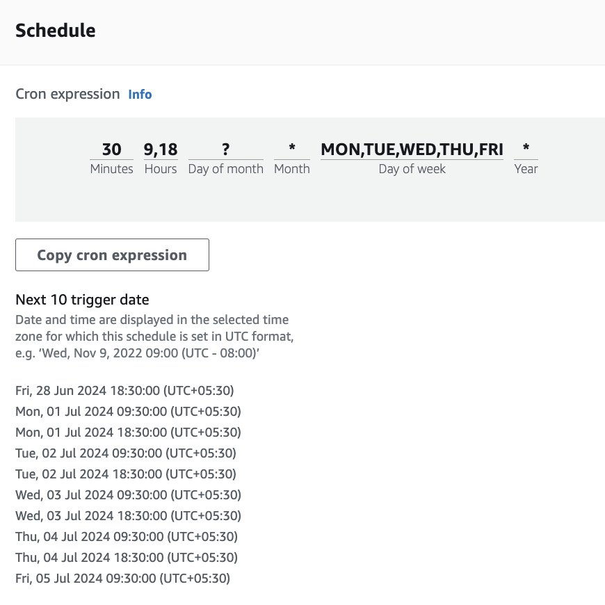

# Elevate Attendance Automation

This project automates the process of logging into elevate.peoplestrong.com and punching in/out attendance on a daily basis. It is designed to run on AWS Lambda, providing a serverless solution to manage daily attendance without manual intervention.

## Features

- **Automated Login**: Securely logs into elevate.peoplestrong.com using credentials stored in AWS Secrets Manager.
- **Attendance Punch-In/Out**: Automatically punches in at the start of the day and punches out at the end of the day based on predefined schedules.
- **Serverless Deployment**: Runs on AWS Lambda, ensuring high availability and scalability without the need for server management.
- **Notification System**: Sends notifications via email or SMS in case of successful punch-in/out or if any errors occur.

## Prerequisites

- AWS Account
- Python 3.11 runtime environment
- Access to elevate.peoplestrong.com with valid credentials

## Setup

1. **Clone the Repository**

    ```sh
    git clone git@github.com:PaperBoardOfficial/attendance-marker.git
    cd attendance-marker
    ```

2. **Build a zip file**
    Write your username, passwords in src/config.json file.

    Use the provided `MakeFile` to build the project.

    ```sh
    make
    ```

3. **Deploy to AWS Lambda**

    You could use the attendance.yaml SAM file for reference.

5. **Schedule Execution**

    Use AWS EventBridge (CloudWatch Events) to schedule your Lambda function to run at your desired punch-in and punch-out times. You could refer this: 

## Usage

Once deployed and scheduled, the Lambda function will automatically log into elevate.peoplestrong.com and punch in/out based on the configured schedule. You can monitor the execution logs in AWS CloudWatch for status updates and potential errors.

## Contributing

Contributions are welcome! Please feel free to submit pull requests or open issues to improve the project.

## License

This project is licensed under the MIT License - see the [LICENSE](LICENSE) file for details.